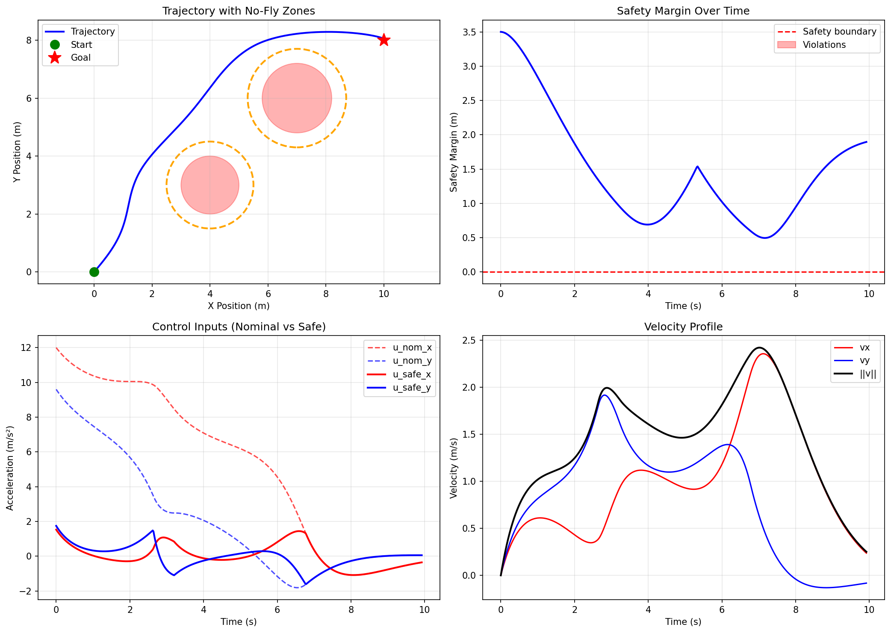

# CBF-Based Safe Quadrotor Navigation

A Python implementation of Control Barrier Function (CBF) based safety-critical control for 2D quadrotor navigation with no-fly zone avoidance.


## Overview

This project implements a **safety filter** using Control Barrier Functions (CBFs) to ensure a quadrotor safely navigates to a goal position while avoiding circular no-fly zones. The system uses:

- **Double integrator dynamics** for simplified 2D motion modeling
- **Exponential CBF (ECBF)** constraints for relative degree 2 systems
- **Quadratic Programming (QP)** to optimally modify unsafe control inputs
- **PD controller** as the nominal goal-reaching policy

### Key Features

✅ **Mathematically rigorous safety guarantees** via CBF theory  
✅ **Real-time QP-based safety filtering** using OSQP  
✅ **Multiple no-fly zone support**  
✅ **Comprehensive visualization** of trajectory, safety margins, and control signals  
✅ **Clean, modular code structure** with detailed documentation  
✅ **Timestamped result logging** for reproducibility  

## Demo

The quadrotor navigates from `(0, 0)` to `(10, 8)` while avoiding two circular obstacles:

```
Start: (0, 0)  →  Goal: (10, 8)
Obstacles: 
  - Circle at (4, 3) with radius 1.5m
  - Circle at (7, 6) with radius 1.7m
```

**Sample Output:**

```
Running simulation...
Goal reached at t=12.34s

=== Simulation Results ===
Final position: (10.00, 8.00)
Goal position: (10.00, 8.00)
Distance to goal: 0.045 m
Minimum safety margin: 0.312 m
Violations detected: 0
```
   


## Installation

### Prerequisites

- Python 3.8 or higher
- pip package manager

### Setup

1. **Clone the repository:**
   ```bash
   git clone https://github.com/YOUR_USERNAME/cbf-quadrotor-simulation.git
   cd cbf-quadrotor-simulation
   ```

2. **Create a virtual environment (recommended):**
   ```bash
   python -m venv .venv
   
   # Windows
   .venv\Scripts\activate
   
   # Linux/Mac
   source .venv/bin/activate
   ```

3. **Install dependencies:**
   ```bash
   pip install -r requirements.txt
   ```

## Usage

### Basic Simulation

Run the default scenario:

```bash
cd src
python -m cbf_quadrotor.sim
```

This will:
- Run the simulation
- Display a 4-panel plot showing trajectory, safety margins, controls, and velocities
- Save results to `results/` directory with timestamp

### Project Structure

```
cbf-quadrotor-simulation/
├── src/
│   └── cbf_quadrotor/
│       ├── __init__.py          # Package initialization
│       ├── sim.py               # Main simulation loop & visualization
│       ├── cbf.py               # CBF safety filter implementation
│       ├── dynamics.py          # Double integrator dynamics
│       ├── controllers.py       # PD nominal controller
│       ├── environment.py       # Scenario & parameter setup
│       └── utils.py             # Utility functions
├── results/                     # Auto-generated simulation results
│   ├── cbf_simulation_*.png     # Plots
│   └── cbf_data_*.npz           # Raw data
├── requirements.txt             # Python dependencies
└── README.md
```

### Customizing the Scenario

Edit `src/cbf_quadrotor/environment.py` to modify:

**Change start/goal positions:**
```python
start = np.array([0.0, 0.0, 0.0, 0.0])  # [px, py, vx, vy]
goal = np.array([10.0, 8.0])             # [px, py]
```

**Add/modify no-fly zones:**
```python
zones = [
    {'center': np.array([4.0, 3.0]), 'radius': 1.5},
    {'center': np.array([7.0, 6.0]), 'radius': 1.7},
    {'center': np.array([5.0, 5.0]), 'radius': 2.0},  # New zone
]
```

**Tune controller gains:**
```python
'kp': 1.2,  # Proportional gain (higher → faster convergence)
'kd': 1.8,  # Derivative gain (higher → more damping)
```

**Adjust safety parameters:**
```python
'k0': 1.0,  # CBF parameter (higher → more conservative)
'k1': 2.0,  # CBF parameter (higher → larger safety margin)
```

## Mathematical Background

### System Dynamics

The quadrotor is modeled as a 2D double integrator:

```
State:    x = [px, py, vx, vy]ᵀ
Control:  u = [ax, ay]ᵀ

Dynamics:
  ṗ = v
  v̇ = u
```

### Control Barrier Functions

For circular no-fly zones with center `c` and radius `R`:

**Barrier function:**
```
h(p) = ||p - c||² - R² ≥ 0
```

**ECBF Constraint (for relative degree 2):**
```
ḧ + k₁·ḣ + k₀·h ≥ 0
```

**Derivation:**
```
h(p) = (px - cx)² + (py - cy)² - R²
ḣ = 2(p - c)ᵀ·v
ḧ = 2||v||² + 2(p - c)ᵀ·u
```

**Linear constraint form:**
```
A·u ≥ b

where:
  A = 2(p - c)ᵀ
  b = -2||v||² - k₁·ḣ - k₀·h
```

### QP Safety Filter

At each timestep, solve:

```
minimize    ||u - u_nom||²
subject to  Aᵢ·u ≥ bᵢ  ∀ obstacles i
            ||u|| ≤ a_max
```

This finds the closest safe control to the nominal controller output.

## Results

### Visualization

The simulation generates a 4-panel plot:

1. **Trajectory Plot**: Shows the path taken, start/goal, and no-fly zones
2. **Safety Margin**: Displays minimum distance to obstacles over time
3. **Control Inputs**: Compares nominal vs. safety-filtered controls
4. **Velocity Profile**: Shows velocity components and speed

### Data Export

Raw simulation data is saved as `.npz` files and can be loaded for analysis:

```python
import numpy as np

# Load data
data = np.load('results/cbf_data_20240116_143022.npz')

# Extract variables
trajectory = data['trajectory']      # (N, 4) state history
controls = data['controls_safe']     # (N, 2) control history
margins = data['safety_margins']     # (N,) safety margins
params = data['params'].item()       # simulation parameters
```

## Parameter Tuning Guide

### Controller Gains
- **kp**: Increase for faster goal convergence (typical: 0.5 - 2.0)
- **kd**: Increase for more damping (typical: 1.0 - 3.0)
- Rule of thumb: `kd ≈ 2√kp` for critical damping

### CBF Parameters
- **k0, k1**: Higher values → more conservative safety
- Recommended: `k1 > 2√k0` for proper damping
- Default: `k0=1.0, k1=2.0` balances safety and performance

### Safety Margin
- **d_safe**: Buffer distance around obstacles (typical: 0.3 - 1.0 m)
- Larger margin → safer but more constrained paths

### Acceleration Limit
- **a_max**: Based on maximum tilt angle `θ_max`
- Formula: `a_max = g·tan(θ_max)`
- 25° tilt → `a_max ≈ 4.57 m/s²` (default)

## Dependencies

- **numpy**: Numerical computations
- **scipy**: Sparse matrices for QP formulation
- **matplotlib**: Visualization
- **osqp**: Fast quadratic programming solver

## Troubleshooting

**"QP solver failed"**
- Increase safety margin `d_safe`
- Reduce CBF aggressiveness (`k0`, `k1`)
- Check that obstacles don't block all paths to goal

**Vehicle oscillates near obstacles**
- Reduce controller gains `kp`, `kd`
- Increase CBF damping parameter `k1`

**Slow convergence to goal**
- Increase controller gains `kp`, `kd`
- Reduce safety margin if too conservative

## Future Enhancements

- [ ] 3D dynamics with full attitude control
- [ ] Moving/time-varying obstacles
- [ ] Multi-agent coordination
- [ ] Model Predictive Control (MPC) integration
- [ ] ROS interface for real quadrotor testing
- [ ] C++ QP solver for faster performance

## References

1. Ames, A. D., et al. (2014). "Control Barrier Functions: Theory and Applications." *European Control Conference*.
2. Xiao, W., & Belta, C. (2021). "Control Barrier Functions for Systems with High Relative Degree." *IEEE CDC*.
3. Stellato, B., et al. (2020). "OSQP: An Operator Splitting Solver for Quadratic Programs." *Mathematical Programming Computation*.

## License

This project is licensed under the MIT License - see the LICENSE file for details.
